# Telegram Bot Webhook Service

<div align="center">


**Enterprise-grade Telegram Bot with webhook integration**

[Features](#features) • [Quick Start](#quick-start) • [Configuration](#configuration) • [Bot Commands](#bot-commands) • [Architecture](#architecture) • [Security](#security) • [Development](#development)

</div>

---

## Features

| Feature | Description |
|---------|-------------|
| **Webhook-based** | Receives Telegram updates via HTTP webhook with automatic retry |
| **Secure** | IPv4/IPv6 filtering, secret token validation, background processing |
| **Bot Commands** | Built-in `/start` and `/help` commands with user responses |
| **Input Classification** | Automatically detects message types (text, photo, document, etc.) |
| **Enterprise Logging** | Rotating file logs, colored console banner, multi-worker safe |
| **High Concurrency** | Multi-worker uvicorn with configurable limits |
| **Docker Ready** | Optimized multi-stage build with docker-compose |
| **Type Safe** | Full type hints with mypy strict mode |
| **Tested** | Comprehensive unit and E2E tests with pytest |

---

## Quick Start

### Prerequisites

- Python 3.10+ (or Docker)
- Telegram Bot token from [@BotFather](https://t.me/BotFather)
- Public HTTPS URL (ngrok, Cloudflare Tunnel, etc.)

### With Docker (Recommended)

```bash
# 1. Configure environment
cp .env.example .env
# Edit .env with your TELEGRAM_BOT_TOKEN and WEBHOOK_HOST

# 2. Build and run
docker compose up -d --build

# 3. Check logs
docker compose logs -f

# 4. View file logs
tail -f logs/telegram_bot.log
```

### Without Docker

```bash
# Clone and install
git clone <repository-url>
cd telegram-bot
python -m venv venv
source venv/bin/activate
pip install -e ".[dev]"

# Configure and run
cp .env.example .env
# Edit .env with your settings
telegram-bot
```

---

## Architecture

### System Overview

```mermaid
flowchart TB
    subgraph Internet["☁️ Internet"]
        TG["📱 Telegram Servers<br/><small>IPv4: 149.154.160.0/20, 91.108.4.0/22<br/>IPv6: 2001:67c:4e8::/48, 2001:b28:f23d::/48</small>"]
    end

    subgraph Docker["🐳 Docker Container"]
        subgraph App["⚡ FastAPI Application"]
            WH["🔗 Webhook Endpoint<br/><small>/webhook</small>"]
            HC["❤️ Health Check<br/><small>/health</small>"]
        end

        subgraph Security["🔒 Security Layer"]
            IPF["🛡️ IP Filter"]
            ST["🔑 Secret Token<br/>Validation"]
        end

        subgraph Processing["⚙️ Processing"]
            BG["📤 Background Task"]
            DP["🎯 Dispatcher"]
            IC["📊 Input Classifier"]
        end

        subgraph Logging["📝 Logging"]
            CL["🖥️ Console<br/><small>Colored Banner</small>"]
            FL["📄 File Logs<br/><small>Rotating</small>"]
        end
    end

    subgraph Host["💻 Host Machine"]
        LV["📁 logs/<br/><small>telegram_bot.log<br/>telegram_bot.error.log</small>"]
    end

    TG -->|HTTPS POST| WH
    WH --> IPF
    IPF --> ST
    ST --> BG
    BG --> DP
    DP --> IC
    IC --> CL
    IC --> FL
    FL -.->|Volume Mount| LV

    style TG fill:#0088cc,color:#fff
    style WH fill:#009688,color:#fff
    style HC fill:#4CAF50,color:#fff
    style IPF fill:#ff5722,color:#fff
    style ST fill:#ff9800,color:#fff
    style BG fill:#9c27b0,color:#fff
    style DP fill:#3f51b5,color:#fff
    style IC fill:#00bcd4,color:#fff
    style CL fill:#607d8b,color:#fff
    style FL fill:#795548,color:#fff
    style LV fill:#8bc34a,color:#fff
```



### Webhook Flow

```mermaid
sequenceDiagram
    autonumber
    participant TG as 📱 Telegram
    participant WH as 🔗 Webhook
    participant IP as 🛡️ IP Filter
    participant ST as 🔑 Secret Token
    participant BG as 📤 Background
    participant DP as 🎯 Dispatcher
    participant IC as 📊 Classifier
    participant LOG as 📝 Logger

    TG->>+WH: POST /webhook
    WH->>+IP: Check IP

    alt Invalid IP
        IP-->>WH: ❌ Reject
        WH-->>TG: 403 Forbidden
    else Valid IP
        IP->>+ST: Validate Token

        alt Invalid Token
            ST-->>WH: ❌ Reject
            WH-->>TG: 401 Unauthorized
        else Valid Token
            ST->>+BG: Create Task
            BG-->>-WH: ✅ Accepted
            WH-->>-TG: 200 OK

            Note over BG,LOG: Async Processing
            BG->>+DP: Process Update
            DP->>+IC: Classify Input
            IC->>LOG: Log Message
            IC-->>-DP: Input Type
            DP-->>-BG: ✅ Done
        end
    end
```



### Multi-Worker Architecture

```mermaid
flowchart LR
    subgraph Uvicorn["🚀 Uvicorn"]
        M["👑 Master Process"]
        W1["👷 Worker 1"]
        W2["👷 Worker 2"]
        W3["👷 Worker 3"]
        W4["👷 Worker 4"]
    end

    subgraph Shared["📦 Shared Resources"]
        BOT["🤖 Bot Instance"]
        LOG["📝 Log Files"]
        TMP["🚩 Banner Lock<br/><small>/tmp/.banner_printed</small>"]
    end

    M --> W1
    M --> W2
    M --> W3
    M --> W4

    W1 --> BOT
    W2 --> BOT
    W3 --> BOT
    W4 --> BOT

    W1 --> LOG
    W2 --> LOG
    W3 --> LOG
    W4 --> LOG

    W1 -.->|First Only| TMP

    style M fill:#e91e63,color:#fff
    style W1 fill:#2196f3,color:#fff
    style W2 fill:#2196f3,color:#fff
    style W3 fill:#2196f3,color:#fff
    style W4 fill:#2196f3,color:#fff
    style BOT fill:#0088cc,color:#fff
    style LOG fill:#795548,color:#fff
    style TMP fill:#607d8b,color:#fff
```



---

## Configuration

### Environment Variables

Copy `.env.example` to `.env` and configure:

```bash
cp .env.example .env
```

### Telegram & Webhook

| Variable | Description | Default |
|----------|-------------|---------|
| `TELEGRAM_BOT_TOKEN` | Bot API token from BotFather | **Required** |
| `WEBHOOK_HOST` | Public HTTPS URL | **Required** |
| `WEBHOOK_PATH` | Webhook endpoint path | `/webhook` |
| `WEBHOOK_SECRET` | Secret token for verification | **Required** |
| `WEBHOOK_MAX_CONNECTIONS` | Max HTTPS connections (1-100) | `100` |
| `WEBHOOK_IP_FILTER_ENABLED` | Filter to Telegram IPs only | `true` |
| `WEBHOOK_DROP_PENDING_UPDATES` | Drop old updates on setup | `true` |

### Server

| Variable | Description | Default |
|----------|-------------|---------|
| `SERVER_HOST` | Server bind address | `0.0.0.0` |
| `SERVER_PORT` | Server port | `8002` |
| `ENVIRONMENT` | Environment mode | `development` |
| `LOG_LEVEL` | Logging level | `INFO` |
| `DEBUG` | Enable debug mode | `false` |

### Concurrency

| Variable | Description | Default |
|----------|-------------|---------|
| `WORKERS` | Uvicorn workers (recommended: 2×CPU+1) | `4` |
| `LIMIT_CONCURRENCY` | Max concurrent connections per worker | `100` |
| `LIMIT_MAX_REQUESTS` | Requests before worker restart | `10000` |
| `BACKLOG` | Connection backlog queue size | `2048` |

### Timeouts

| Variable | Description | Default |
|----------|-------------|---------|
| `TIMEOUT_KEEP_ALIVE` | Keep idle connections (seconds) | `5` |
| `TIMEOUT_GRACEFUL_SHUTDOWN` | Graceful shutdown wait (seconds) | `30` |

### Performance

| Variable | Description | Default |
|----------|-------------|---------|
| `HTTP_IMPLEMENTATION` | HTTP parser (`auto`, `h11`, `httptools`) | `auto` |
| `LOOP_IMPLEMENTATION` | Event loop (`auto`, `asyncio`, `uvloop`) | `auto` |

### Logging

| Variable | Description | Default |
|----------|-------------|---------|
| `LOG_TO_FILE` | Write logs to file | `true` |
| `LOG_DIR` | Directory for log files | `./logs` |
| `LOG_MAX_SIZE_MB` | Max file size before rotation | `10` |
| `LOG_BACKUP_COUNT` | Number of backup files to keep | `5` |

---

## Bot Commands

The bot responds to the following commands:

| Command | Description |
|---------|-------------|
| `/start` | Welcome message with bot capabilities |
| `/help` | List of available commands and supported content types |

### Command Responses

**`/start`** - Displays a welcome message:
```
¡Bienvenido! 👋

Soy un bot de Telegram con soporte para webhook.

Puedo procesar diferentes tipos de mensajes:
• Texto, Fotos, Documentos, Videos, Audio, Ubicaciones...

Usa /help para ver los comandos disponibles.
```

**`/help`** - Shows available commands and supported content types.

---

## Input Classification

The bot classifies incoming messages into the following types:

```mermaid
mindmap
  root((📨 Message))
    📝 Text
      Plain text
      Commands /
    📷 Media
      Photo
      Video
      Animation
      Sticker
    📄 Files
      Document
      Audio
      Voice
      Video Note
    📍 Location
      Location
      Venue
    👤 Other
      Contact
      Poll
      Dice
```



| Type | Description | Example |
|------|-------------|---------|
| `text` | Plain text messages | "Hello, bot!" |
| `command` | Bot commands | `/start`, `/help` |
| `photo` | Photo messages | Image files |
| `document` | File attachments | PDF, ZIP, etc. |
| `video` | Video messages | MP4, MOV |
| `audio` | Audio files | MP3, OGG |
| `voice` | Voice messages | Voice recordings |
| `video_note` | Round videos | Video circles |
| `sticker` | Stickers | Animated/static |
| `animation` | GIFs | Animations |
| `location` | Location sharing | GPS coordinates |
| `venue` | Place sharing | Named locations |
| `contact` | Contact sharing | Phone contacts |
| `poll` | Polls | Questions |
| `dice` | Random numbers | 🎲 🎯 🏀 |

---

## Project Structure

```
telegram-bot/
├── 📄 Dockerfile              # Multi-stage production build
├── 📄 docker-compose.yml      # Container orchestration
├── 📄 pyproject.toml          # Python packaging & tools
├── 📄 .env.example            # Environment template
├── 📁 logs/                   # Log files (bind mounted)
│   ├── telegram_bot.log       # Main application log
│   └── telegram_bot.error.log # Error-only log
└── 📁 src/telegram_bot/
    ├── 📄 main.py             # Entry point
    ├── 📄 app.py              # FastAPI + webhook
    ├── 📄 logging_config.py   # Banner & logging setup
    ├── 📁 config/
    │   └── settings.py        # Pydantic v2 config
    ├── 📁 bot/handlers/
    │   └── message_handler.py # Message handling
    ├── 📁 services/
    │   ├── input_classifier.py    # Type classification
    │   └── webhook_service.py     # Security & IP filter
    └── 📁 tests/
        └── test_*.py          # Test files
```

---

## Security

### IP Filtering (IPv4 + IPv6)

The webhook only accepts requests from Telegram's official IP ranges:

```mermaid
flowchart LR
    subgraph Allowed["✅ Allowed IPs"]
        subgraph IPv4["IPv4 Ranges"]
            R1["149.154.160.0/20"]
            R2["91.108.4.0/22"]
        end
        subgraph IPv6["IPv6 Ranges"]
            R3["2001:67c:4e8::/48"]
            R4["2001:b28:f23d::/48"]
            R5["2001:b28:f23f::/48"]
        end
    end

    subgraph Blocked["❌ Blocked"]
        B1["All other IPs"]
        B2["Empty/Unknown"]
    end

    REQ["📨 Request"] --> CHECK{"🔍 IP Check"}
    CHECK -->|Match| R1
    CHECK -->|Match| R2
    CHECK -->|Match| R3
    CHECK -->|No Match| B1
    CHECK -->|Invalid| B2

    R1 --> ALLOW["✅ 200 OK"]
    R2 --> ALLOW
    R3 --> ALLOW
    B1 --> DENY["❌ 403 Forbidden"]
    B2 --> DENY

    style R1 fill:#4CAF50,color:#fff
    style R2 fill:#4CAF50,color:#fff
    style R3 fill:#2196F3,color:#fff
    style R4 fill:#2196F3,color:#fff
    style R5 fill:#2196F3,color:#fff
    style B1 fill:#f44336,color:#fff
    style B2 fill:#f44336,color:#fff
    style ALLOW fill:#4CAF50,color:#fff
    style DENY fill:#f44336,color:#fff
```



**Configuration:**
- Disable with `WEBHOOK_IP_FILTER_ENABLED=false` if behind a proxy
- Empty or "unknown" IPs are automatically blocked

### Secret Token Validation

Every webhook request validates the `X-Telegram-Bot-Api-Secret-Token` header against `WEBHOOK_SECRET`.

### Proxy Security Note

> ⚠️ **Important**: `X-Forwarded-For` and `X-Real-IP` headers can be spoofed by clients.
> Only trust these headers when behind a properly configured reverse proxy that overwrites (not appends to) these headers.

### Docker Security

- **Non-root user**: Runs as `appuser` (UID 1000)
- **Read-only filesystem**: Except for `/app/logs` and `/tmp`
- **No new privileges**: `security_opt: no-new-privileges`
- **Resource limits**: CPU and memory constraints
- **Graceful cleanup**: Guaranteed session close on shutdown

---

## Development

### Running Tests

```bash
# All tests with coverage
pytest

# Specific test file
pytest src/telegram_bot/tests/test_input_classifier.py

# With HTML coverage report
pytest --cov-report=html
```

### Code Quality

```bash
# Format
black src/
isort src/

# Lint
ruff check src/

# Type check
mypy src/telegram_bot/
```

### Validate Environment

```bash
python scripts/validate_env.py
```

---

## API Endpoints

| Endpoint | Method | Description | Auth |
|----------|--------|-------------|------|
| `/webhook` | POST | Telegram webhook | IP + Secret Token |
| `/health` | GET | Health check | None |

---

## Docker Commands

```bash
# Build and start
docker compose up -d --build

# View logs
docker compose logs -f telegram-bot

# View file logs
tail -f logs/telegram_bot.log

# Restart
docker compose restart

# Stop
docker compose down
```

---

## License

MIT License - see [LICENSE](LICENSE) for details.
