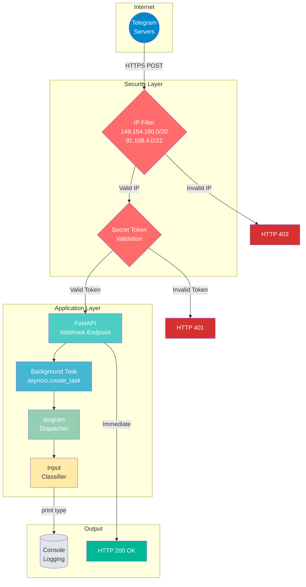
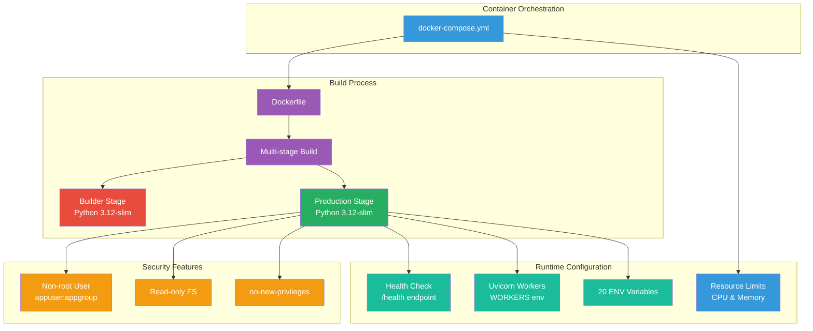
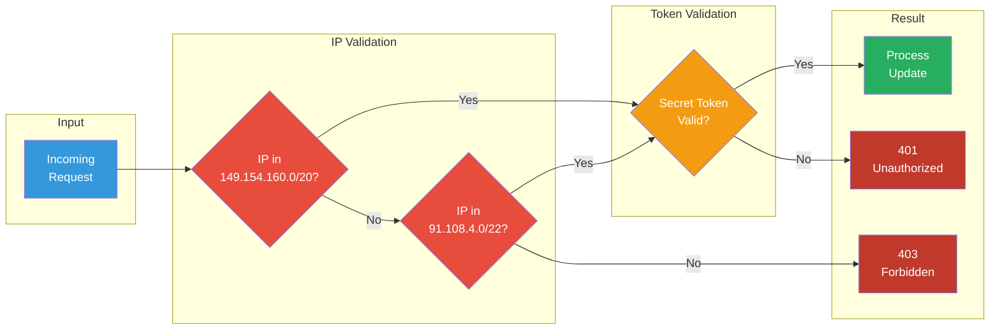
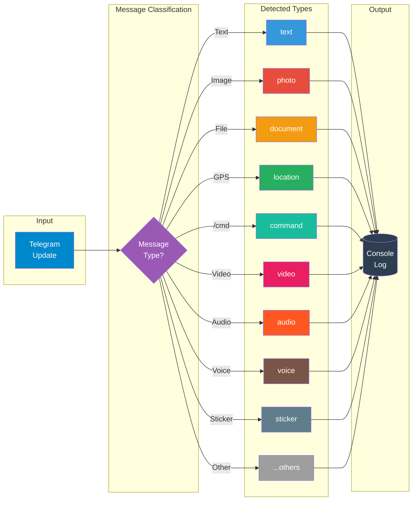

# REQ-1: Bot de Telegram Empresarial con Webhook en Python

## Resumen

Aplicación empresarial en Python (3.10+) que implementa un bot de
Telegram mediante webhook, con arquitectura modular, pydantic v2,
pruebas E2E, CI, cumplimiento PEP8, Docker, seguridad avanzada,
alta concurrencia y mejores prácticas modernas.

## Objetivo

Construir un bot robusto que reciba mensajes desde Telegram, determine
el tipo de input (texto, imagen, documento, etc.) y lo imprima en
consola, manteniendo estándares empresariales de calidad, empaquetado,
pruebas, documentación, containerización y CI/CD.

## Reglas de Implementación

-   TODO debe estar en idioma inglés.
-   Atender *Minor issues* al cierre de cada iteración.
-   Pruebas E2E completas por cada componente.
-   Documentar todo en `README.md`.
-   Actualizar estado del proyecto en `.Claude`.
-   No usar librerías ni patrones legacy.
-   Solo librerías modernas, estables y compatibles.
-   Pydantic v2 para toda la configuración.
-   Código limpio, PEP8, sin imports muertos, sin antipatrones.
-   Revisar `mypy`, `ruff`, `black`, `isort`.
-   Validar `.env.example` frente a `settings.py`.
-   Arquitectura de paquete Python moderno y distribuible.
-   Aplicar SOLID, KISS, DRY.
-   Archivos \< 280 líneas.
-   Type hints completos.
-   Manejo robusto de errores.
-   Sin hardcoding; configuración dinámica.
-   Chain-of-Thought + Self-Consistency en clasificadores.
-   No usar fallbacks: investigar y justificar siempre 2 alternativas
    antes de decidir.
-   Buenas prácticas SIEMPRE como prioridad.
-   Utiliza https://www.makeareadme.com/ para generar documentación readme.md crear diagramas en mermaid usando un estilo visual atractivo y profesional.Utiliza colores de   formas y letras que sean visibles  en los diagramar de mermaid
-   Google docstrings

## Reglas de Docker

-   Dockerfile con multi-stage build para optimización.
-   Usuario no-root para seguridad.
-   Health checks configurados.
-   docker-compose.yml con mejores prácticas.
-   .dockerignore para builds optimizados.
-   Sin redundancia ni hardcoding en configuración.
-   Variables de entorno desde `.env`.
-   Puerto por defecto: 8002.

## Reglas de Concurrencia

-   Uvicorn con múltiples workers para usuarios concurrentes.
-   Factory pattern para aislamiento de procesos.
-   Configuración dinámica de workers vía `WORKERS` env var.
-   `LIMIT_CONCURRENCY`: máximo de conexiones concurrentes por worker.
-   `LIMIT_MAX_REQUESTS`: reinicio de worker tras N requests (previene memory leaks).
-   `BACKLOG`: cola de conexiones pendientes para picos de tráfico.

## Reglas de Timeouts

-   `TIMEOUT_KEEP_ALIVE`: segundos para mantener conexiones idle.
-   `TIMEOUT_GRACEFUL_SHUTDOWN`: tiempo para shutdown graceful.

## Reglas de Performance

-   `HTTP_IMPLEMENTATION`: auto/h11/httptools (httptools es más rápido).
-   `LOOP_IMPLEMENTATION`: auto/asyncio/uvloop (uvloop es más rápido en Linux).

## Reglas de Seguridad del Webhook

-   **Filtrado de IP**: Solo aceptar requests de rangos oficiales de Telegram:
    -   `149.154.160.0/20`
    -   `91.108.4.0/22`
-   **Secret Token**: Validación del header `X-Telegram-Bot-Api-Secret-Token`.
-   **Procesamiento en Background**: Respuesta inmediata HTTP 200 a Telegram,
    procesamiento asíncrono con `asyncio.create_task`.
-   **Configuración flexible**: IP filter desactivable para proxies.

## Comparación de Alternativas

### Opción A: aiogram (asíncrono)

-   Moderno, rápido, orientado a arquitectura async.
-   Integración óptima con FastAPI.

### Opción B: python-telegram-bot

-   Maduro, fácil de usar, pero menos eficiente para integraciones async
    grandes.

**Elección:** aiogram + FastAPI por rendimiento, compatibilidad y
escalabilidad.

## Estructura del Proyecto

    multi-channel-service/
    ├─ Dockerfile
    ├─ docker-compose.yml
    ├─ .dockerignore
    ├─ pyproject.toml
    ├─ README.md
    ├─ .env.example
    ├─ .github/workflows/ci.yml
    ├─ REQ/REQ-1.md
    ├─ scripts/validate_env.py
    └─ src/telegram_bot/
       ├─ __init__.py
       ├─ main.py
       ├─ app.py
       ├─ logging_config.py
       ├─ config/
       │  ├─ __init__.py
       │  └─ settings.py          # 20 variables configurables
       ├─ bot/
       │  ├─ __init__.py
       │  └─ handlers/
       │     ├─ __init__.py
       │     └─ message_handler.py
       ├─ services/
       │  ├─ __init__.py
       │  ├─ input_classifier.py
       │  └─ webhook_service.py   # IP filtering & security
       └─ tests/
          ├─ __init__.py
          ├─ conftest.py
          ├─ test_settings.py
          ├─ test_input_classifier.py
          └─ test_webhook_e2e.py

## Variables de Configuración (20 total)

### Telegram Bot
| Variable | Descripción | Default |
|----------|-------------|---------|
| `TELEGRAM_BOT_TOKEN` | Token del bot | Requerido |

### Webhook
| Variable | Descripción | Default |
|----------|-------------|---------|
| `WEBHOOK_HOST` | URL pública HTTPS | Requerido |
| `WEBHOOK_PATH` | Path del endpoint | `/webhook` |
| `WEBHOOK_SECRET` | Token secreto | Requerido |
| `WEBHOOK_MAX_CONNECTIONS` | Conexiones simultáneas (1-100) | `100` |
| `WEBHOOK_IP_FILTER_ENABLED` | Filtrar IPs de Telegram | `true` |
| `WEBHOOK_DROP_PENDING_UPDATES` | Descartar updates pendientes | `true` |

### Server
| Variable | Descripción | Default |
|----------|-------------|---------|
| `SERVER_HOST` | Host del servidor | `0.0.0.0` |
| `SERVER_PORT` | Puerto del servidor | `8002` |
| `ENVIRONMENT` | Ambiente | `development` |
| `LOG_LEVEL` | Nivel de log | `INFO` |
| `DEBUG` | Modo debug | `false` |

### Concurrencia
| Variable | Descripción | Default |
|----------|-------------|---------|
| `WORKERS` | Workers de uvicorn | `4` |
| `LIMIT_CONCURRENCY` | Conexiones por worker | `100` |
| `LIMIT_MAX_REQUESTS` | Requests antes de reinicio | `10000` |
| `BACKLOG` | Cola de conexiones | `2048` |

### Timeouts
| Variable | Descripción | Default |
|----------|-------------|---------|
| `TIMEOUT_KEEP_ALIVE` | Keep-alive (segundos) | `5` |
| `TIMEOUT_GRACEFUL_SHUTDOWN` | Shutdown graceful (segundos) | `30` |

### Performance
| Variable | Descripción | Default |
|----------|-------------|---------|
| `HTTP_IMPLEMENTATION` | Implementación HTTP | `auto` |
| `LOOP_IMPLEMENTATION` | Event loop | `auto` |

## Comportamiento del Webhook

1.  Recibe request de Telegram.
2.  Valida IP del cliente (filtro de IPs de Telegram).
3.  Valida `X-Telegram-Bot-Api-Secret-Token`.
4.  Parsea `Update` con aiogram.
5.  Crea task en background para procesar.
6.  Responde 200 inmediatamente a Telegram.
7.  Clasifica tipo de input.
8.  Imprime tipo detectado en consola.

## Diagramas (Mermaid)

### Arquitectura General

### Arquitectura Docker

### Flujo de Seguridad

### Flujo de Clasificación

## Pruebas

-   Unit: cobertura de handlers, classifier y webhook_service.
-   Integration: simulación de POST al webhook con payloads reales.
-   E2E: validar impresión correcta y HTTP 200.
-   Security: validar filtrado de IPs y tokens.

## CI/CD

-   ruff → black → isort → mypy → pytest → build wheel.
-   GitHub Actions integrado.

## Checklist de Calidad

### Código
-   [x] Código PEP8
-   [x] 0 imports muertos
-   [x] mypy sin errores
-   [x] ruff sin warnings
-   [x] black/isort limpios
-   [x] Type hints completos

### Documentación
-   [x] README.md actualizado
-   [x] REQ-1.md actualizado
-   [x] .env.example validado (20 variables)

### Testing
-   [x] Pruebas E2E funcionando
-   [x] Tests de clasificador
-   [x] Tests de webhook

### Docker
-   [x] Dockerfile multi-stage
-   [x] docker-compose.yml con mejores prácticas
-   [x] .dockerignore configurado
-   [x] Usuario no-root en container
-   [x] Health checks configurados
-   [x] Puerto 8002 por defecto

### Concurrencia
-   [x] Uvicorn workers para concurrencia
-   [x] LIMIT_CONCURRENCY configurado
-   [x] LIMIT_MAX_REQUESTS configurado
-   [x] BACKLOG configurado

### Timeouts
-   [x] TIMEOUT_KEEP_ALIVE configurado
-   [x] TIMEOUT_GRACEFUL_SHUTDOWN configurado

### Performance
-   [x] HTTP_IMPLEMENTATION configurable
-   [x] LOOP_IMPLEMENTATION configurable

### Seguridad
-   [x] Filtrado de IPs de Telegram
-   [x] Validación de secret token
-   [x] Procesamiento en background
-   [x] Sin hardcoding en Docker

## Conclusión

Este documento define el blueprint profesional para una aplicación
empresarial basada en Telegram Webhooks usando Python, aiogram, FastAPI,
Docker y las mejores prácticas modernas de ingeniería, con énfasis en
seguridad, alta concurrencia y configuración flexible.
