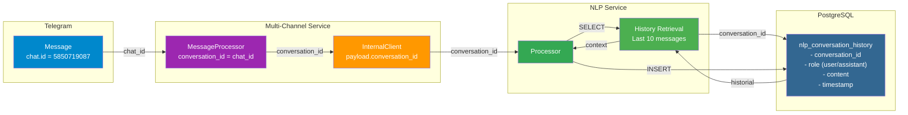

```mermaid
sequenceDiagram
    participant U as Usuario
    participant TG as Telegram
    participant WH as Webhook
    participant IC as InputClassifier
    participant MP as MessageProcessor
    participant NLP as NLP Service
    participant PG as PostgreSQL

    U->>TG: Envía mensaje de texto
    TG->>WH: POST /webhook
    WH->>WH: Validación (IP, Token, Rate)
    WH->>IC: classify(message)
    IC-->>WH: InputType.TEXT
    WH->>MP: process_message()
    MP->>MP: _process_text_message()
    MP->>NLP: call_nlp_service(text, conversation_id)
    NLP->>PG: Recupera historial (últimos 10 msgs)
    PG-->>NLP: Contexto de conversación
    NLP->>NLP: Gemini 2.0 Flash genera respuesta
    NLP->>PG: Guarda mensaje + respuesta
    NLP-->>MP: {response, model, lengths}
    MP-->>WH: ProcessingResult(SUCCESS)
    WH-->>TG: message.answer(response)
    TG-->>U: Muestra respuesta
```

```mermaid
sequenceDiagram
    participant U as Usuario
    participant TG as Telegram
    participant WH as Webhook
    participant MP as MessageProcessor
    participant ASR as ASR Service
    participant NLP as NLP Service

    U->>TG: Envía audio/voz
    TG->>WH: POST /webhook
    WH->>MP: process_message(VOICE/AUDIO)
    MP->>MP: _process_audio_message()
    MP->>TG: bot.get_file(file_id)
    TG-->>MP: file_path
    MP->>TG: Download audio bytes
    TG-->>MP: audio_content
    MP->>ASR: call_asr_service(audio, "voice.ogg")

    alt LOW_CONFIDENCE
        ASR-->>MP: {error_code: "LOW_CONFIDENCE"}
        MP-->>WH: "No pude entender el audio..."
    else SUCCESS
        ASR-->>MP: {transcription, language, confidence}
        MP->>NLP: call_nlp_service(transcription, detected_language)
        NLP-->>MP: {response}
        MP-->>WH: ProcessingResult(SUCCESS)
    end

    WH-->>TG: message.answer(response)
    TG-->>U: Muestra respuesta
```

# REQ-1: Bot de Telegram Empresarial con Webhook en Python

## Resumen

Aplicación empresarial en Python (3.10+) que implementa un bot de
Telegram mediante webhook, con arquitectura modular, pydantic v2,
pruebas E2E, CI, cumplimiento PEP8, Docker, seguridad avanzada,
alta concurrencia y mejores prácticas modernas.

## Objetivo

Construir un bot robusto que reciba mensajes desde Telegram, determine
el tipo de input (texto, imagen, documento, etc.) y lo imprima en
consola, manteniendo estándares empresariales de calidad, empaquetado,
pruebas, documentación, containerización y CI/CD.

## Reglas de Implementación

-   TODO debe estar en idioma inglés.
-   Atender *Minor issues* al cierre de cada iteración.
-   Pruebas E2E completas por cada componente.
-   Documentar todo en `README.md`.
-   Actualizar estado del proyecto en `.Claude`.
-   No usar librerías ni patrones legacy.
-   Solo librerías modernas, estables y compatibles.
-   Pydantic v2 para toda la configuración.
-   Código limpio, PEP8, sin imports muertos, sin antipatrones.
-   Revisar `mypy`, `ruff`, `black`, `isort`.
-   Validar `.env.example` frente a `settings.py`.
-   Arquitectura de paquete Python moderno y distribuible.
-   Aplicar SOLID, KISS, DRY.
-   Archivos \< 280 líneas.
-   Type hints completos.
-   Manejo robusto de errores.
-   Sin hardcoding; configuración dinámica.
-   Chain-of-Thought + Self-Consistency en clasificadores.
-   No usar fallbacks: investigar y justificar siempre 2 alternativas
    antes de decidir.
-   Buenas prácticas SIEMPRE como prioridad.
-   Utiliza https://www.makeareadme.com/ para generar documentación readme.md crear diagramas en mermaid usando un estilo visual atractivo y profesional.Utiliza colores de   formas y letras que sean visibles  en los diagramar de mermaid
-   Google docstrings

## Reglas de Docker

-   Dockerfile con multi-stage build para optimización.
-   Usuario no-root para seguridad.
-   Health checks configurados.
-   docker-compose.yml con mejores prácticas.
-   .dockerignore para builds optimizados.
-   Sin redundancia ni hardcoding en configuración.
-   Variables de entorno desde `.env`.
-   Puerto por defecto: 8002.

## Reglas de Concurrencia

-   Uvicorn con múltiples workers para usuarios concurrentes.
-   Factory pattern para aislamiento de procesos.
-   Configuración dinámica de workers vía `WORKERS` env var.
-   `LIMIT_CONCURRENCY`: máximo de conexiones concurrentes por worker.
-   `LIMIT_MAX_REQUESTS`: reinicio de worker tras N requests (previene memory leaks).
-   `BACKLOG`: cola de conexiones pendientes para picos de tráfico.

## Reglas de Timeouts

-   `TIMEOUT_KEEP_ALIVE`: segundos para mantener conexiones idle.
-   `TIMEOUT_GRACEFUL_SHUTDOWN`: tiempo para shutdown graceful.

## Reglas de Performance

-   `HTTP_IMPLEMENTATION`: auto/h11/httptools (httptools es más rápido).
-   `LOOP_IMPLEMENTATION`: auto/asyncio/uvloop (uvloop es más rápido en Linux).

## Reglas de Seguridad del Webhook

-   **Filtrado de IP**: Solo aceptar requests de rangos oficiales de Telegram:
    -   IPv4: `149.154.160.0/20`, `91.108.4.0/22`
    -   IPv6: `2001:67c:4e8::/48`, `2001:b28:f23d::/48`, `2001:b28:f23f::/48`
-   **Secret Token**: Validación del header `X-Telegram-Bot-Api-Secret-Token` con comparación timing-safe (`hmac.compare_digest`).
-   **Rate Limiting**: Algoritmo sliding window para limitar requests por IP.
-   **Security Headers**: X-Content-Type-Options, X-Frame-Options, CSP, HSTS, etc.
-   **Procesamiento en Background**: Respuesta inmediata HTTP 200 a Telegram,
    procesamiento asíncrono con `asyncio.create_task`.
-   **Configuración flexible**: IP filter desactivable para proxies.
-   **PII Protection**: Truncado de contenido en logs para proteger datos sensibles.

## Comparación de Alternativas

### Opción A: aiogram (asíncrono)

-   Moderno, rápido, orientado a arquitectura async.
-   Integración óptima con FastAPI.

### Opción B: python-telegram-bot

-   Maduro, fácil de usar, pero menos eficiente para integraciones async
    grandes.

**Elección:** aiogram + FastAPI por rendimiento, compatibilidad y
escalabilidad.

## Estructura del Proyecto

    multi-channel-service/
    ├─ Dockerfile
    ├─ docker-compose.yml
    ├─ .dockerignore
    ├─ pyproject.toml
    ├─ README.md
    ├─ .env.example
    ├─ .github/workflows/ci.yml
    ├─ REQ/REQ-1.md
    ├─ scripts/validate_env.py
    ├─ logs/
    │  ├─ telegram_bot.log
    │  └─ telegram_bot.error.log
    └─ src/telegram_bot/
       ├─ __init__.py
       ├─ main.py
       ├─ app.py
       ├─ logging_config.py
       ├─ config/
       │  ├─ __init__.py
       │  └─ settings.py          # 28 variables configurables
       ├─ bot/
       │  ├─ __init__.py
       │  └─ handlers/
       │     ├─ __init__.py
       │     └─ message_handler.py
       ├─ services/
       │  ├─ __init__.py
       │  ├─ input_classifier.py
       │  └─ webhook_service.py   # IP filtering & security
       └─ tests/
          ├─ __init__.py
          ├─ conftest.py
          ├─ test_settings.py
          ├─ test_input_classifier.py
          ├─ test_webhook_e2e.py
          └─ test_webhook_service.py

## API Endpoints

| Endpoint | Method | Description | Auth |
|----------|--------|-------------|------|
| `/webhook` | POST | Telegram webhook endpoint | IP Filter + Secret Token + Rate Limit |
| `/health` | GET | Health check endpoint | None |

### Webhook Endpoint Response Codes

| Code | Description |
|------|-------------|
| `200 OK` | Request accepted and queued for processing |
| `400 Bad Request` | Invalid JSON or malformed Telegram update |
| `401 Unauthorized` | Invalid or missing secret token |
| `403 Forbidden` | Request from non-Telegram IP |
| `429 Too Many Requests` | Rate limit exceeded |

### Health Check Response

```json
{
  "status": "healthy"
}
```

## Variables de Configuración (28 total)

### Telegram Bot
| Variable | Descripción | Default | Validación |
|----------|-------------|---------|------------|
| `TELEGRAM_BOT_TOKEN` | Token del bot desde @BotFather | Requerido | SecretStr |

### Webhook
| Variable | Descripción | Default | Validación |
|----------|-------------|---------|------------|
| `WEBHOOK_HOST` | URL pública HTTPS | Requerido | Debe iniciar con http:// o https:// |
| `WEBHOOK_PATH` | Path del endpoint | `/webhook` | Debe iniciar con `/`, alfanumérico |
| `WEBHOOK_SECRET` | Token secreto para verificación | Requerido | SecretStr |
| `WEBHOOK_MAX_CONNECTIONS` | Conexiones HTTPS simultáneas | `100` | 1-100 |
| `WEBHOOK_IP_FILTER_ENABLED` | Filtrar IPs de Telegram | `true` | boolean |
| `WEBHOOK_DROP_PENDING_UPDATES` | Descartar updates pendientes | `true` | boolean |
| `WEBHOOK_MAX_RETRIES` | Reintentos por flood control | `3` | 1-10 |
| `WEBHOOK_RETRY_BUFFER_SECONDS` | Buffer adicional en retry | `0.5` | 0.0-5.0 |

### Server
| Variable | Descripción | Default | Validación |
|----------|-------------|---------|------------|
| `SERVER_HOST` | Host del servidor | `0.0.0.0` | IP válida o hostname |
| `SERVER_PORT` | Puerto del servidor | `8002` | 1-65535 |
| `ENVIRONMENT` | Ambiente de ejecución | `development` | development/staging/production |
| `LOG_LEVEL` | Nivel de log | `INFO` | DEBUG/INFO/WARNING/ERROR/CRITICAL |
| `DEBUG` | Modo debug | `false` | boolean |

### Concurrencia
| Variable | Descripción | Default | Validación |
|----------|-------------|---------|------------|
| `WORKERS` | Workers de uvicorn | `4` | 1-32 |
| `LIMIT_CONCURRENCY` | Conexiones por worker | `100` | 1-10000 |
| `LIMIT_MAX_REQUESTS` | Requests antes de reinicio | `10000` | 0=unlimited |
| `BACKLOG` | Cola de conexiones | `2048` | 1-65535 |

### Timeouts
| Variable | Descripción | Default | Validación |
|----------|-------------|---------|------------|
| `TIMEOUT_KEEP_ALIVE` | Keep-alive (segundos) | `5` | 1-300 |
| `TIMEOUT_GRACEFUL_SHUTDOWN` | Shutdown graceful (segundos) | `30` | 1-300 |

### Performance
| Variable | Descripción | Default | Validación |
|----------|-------------|---------|------------|
| `HTTP_IMPLEMENTATION` | Implementación HTTP | `auto` | auto/h11/httptools |
| `LOOP_IMPLEMENTATION` | Event loop | `auto` | auto/asyncio/uvloop |

### Logging
| Variable | Descripción | Default | Validación |
|----------|-------------|---------|------------|
| `LOG_TO_FILE` | Escribir logs a archivo | `true` | boolean |
| `LOG_DIR` | Directorio de logs | `./logs` | Path válido |
| `LOG_MAX_SIZE_MB` | Tamaño máximo de archivo | `10` | 1-100 MB |
| `LOG_BACKUP_COUNT` | Archivos de backup | `5` | 1-20 |

### Rate Limiting
| Variable | Descripción | Default | Validación |
|----------|-------------|---------|------------|
| `RATE_LIMIT_REQUESTS` | Requests máximos por ventana | `100` | 10-10000 |
| `RATE_LIMIT_WINDOW_SECONDS` | Ventana de tiempo | `60` | 10-3600 segundos |

## Bot Commands

| Comando | Descripción | Respuesta |
|---------|-------------|-----------|
| `/start` | Iniciar el bot | Mensaje de bienvenida con capacidades |
| `/help` | Mostrar ayuda | Lista de comandos y tipos soportados |

### Respuesta de /start

```html
<b>¡Bienvenido!</b> 👋

Soy un bot de Telegram con soporte para webhook.

Puedo procesar diferentes tipos de mensajes:
• Texto
• Fotos
• Documentos
• Videos
• Audio
• Ubicaciones
• Y más...

Usa /help para ver los comandos disponibles.
```

### Respuesta de /help

```html
<b>Comandos disponibles:</b>

/start - Iniciar el bot
/help - Mostrar esta ayuda

<b>Tipos de contenido soportados:</b>
• Mensajes de texto
• Fotos e imágenes
• Documentos y archivos
• Videos y animaciones
• Mensajes de voz y audio
• Ubicaciones y lugares
• Contactos
• Encuestas
• Stickers
```

## Input Classification (InputType Enum)

| Type | Value | Descripción | Ejemplo |
|------|-------|-------------|---------|
| `TEXT` | `text` | Mensajes de texto plano | "Hola, bot!" |
| `COMMAND` | `command` | Comandos del bot | `/start`, `/help` |
| `PHOTO` | `photo` | Fotos e imágenes | Archivos de imagen |
| `DOCUMENT` | `document` | Documentos y archivos | PDF, ZIP, DOCX |
| `VIDEO` | `video` | Videos | MP4, MOV |
| `AUDIO` | `audio` | Archivos de audio | MP3, OGG |
| `VOICE` | `voice` | Mensajes de voz | Grabaciones de voz |
| `VIDEO_NOTE` | `video_note` | Videos redondos | Círculos de video |
| `STICKER` | `sticker` | Stickers | Animados/estáticos |
| `ANIMATION` | `animation` | GIFs | Animaciones |
| `LOCATION` | `location` | Ubicaciones | Coordenadas GPS |
| `VENUE` | `venue` | Lugares | Ubicaciones con nombre |
| `CONTACT` | `contact` | Contactos | Contactos telefónicos |
| `POLL` | `poll` | Encuestas | Preguntas con opciones |
| `DICE` | `dice` | Dados aleatorios | 🎲 🎯 🏀 ⚽ 🎰 🎳 |
| `UNKNOWN` | `unknown` | Tipo no reconocido | Fallback |

## Comportamiento del Webhook

1.  Recibe request de Telegram via POST.
2.  **Rate Limiting**: Verifica límite de requests por IP.
3.  **IP Filter**: Valida IP del cliente (filtro de IPs de Telegram).
4.  **Secret Token**: Valida `X-Telegram-Bot-Api-Secret-Token` con timing-safe comparison.
5.  **JSON Validation**: Parsea y valida JSON payload.
6.  **Update Validation**: Valida estructura del Update con Pydantic.
7.  Crea task en background para procesar.
8.  Responde 200 OK inmediatamente a Telegram.
9.  Clasifica tipo de input usando Chain-of-Thought.
10. Log del tipo detectado con PII protection.

## Security Features

### 1. Rate Limiting

```python
class RateLimiter:
    """Sliding window rate limiting algorithm."""

    def __init__(self, max_requests: int = 100, window_seconds: int = 60):
        self._max_requests = max_requests
        self._window_seconds = window_seconds
        self._requests: dict[str, list[float]] = {}
        self._lock = asyncio.Lock()
```

- **Algoritmo**: Sliding window con cleanup periódico
- **Thread-safe**: Usa `asyncio.Lock()` para concurrencia
- **Memory-safe**: Limpieza automática de IPs inactivas

### 2. IP Filtering (IPv4 + IPv6)

```python
TELEGRAM_IP_RANGES_V4 = (
    IPv4Network("149.154.160.0/20"),
    IPv4Network("91.108.4.0/22"),
)

TELEGRAM_IP_RANGES_V6 = (
    IPv6Network("2001:67c:4e8::/48"),
    IPv6Network("2001:b28:f23d::/48"),
    IPv6Network("2001:b28:f23f::/48"),
)
```

### 3. Security Headers Middleware

| Header | Value | Propósito |
|--------|-------|-----------|
| `X-Content-Type-Options` | `nosniff` | Previene MIME sniffing |
| `X-Frame-Options` | `DENY` | Previene clickjacking |
| `X-XSS-Protection` | `1; mode=block` | Filtro XSS |
| `Referrer-Policy` | `strict-origin-when-cross-origin` | Control de referrer |
| `Cache-Control` | `no-store` | Previene caching de respuestas |
| `Strict-Transport-Security` | `max-age=31536000; includeSubDomains; preload` | HSTS |
| `Content-Security-Policy` | `default-src 'none'; frame-ancestors 'none'` | CSP |
| `X-Permitted-Cross-Domain-Policies` | `none` | Bloquea políticas cross-domain |
| `Permissions-Policy` | `geolocation=(), microphone=(), camera=()` | Deshabilita APIs sensibles |

### 4. PII Protection

- Contenido de mensajes truncado a 30 caracteres en logs
- Información de usuario limitada a ID y username

### 5. Timing-Safe Authentication

```python
# Comparación segura (constante en tiempo)
hmac.compare_digest(received_token, expected_secret)

# NO USAR (vulnerable a timing attacks)
received_token == expected_secret
```

## Diagramas (Mermaid)

### Arquitectura General


### Arquitectura Docker


### Flujo de Seguridad Completo


### Flujo de Clasificación (Chain-of-Thought)


### Multi-Worker Architecture


## Logging Configuration

### Log Files

| Archivo | Descripción | Rotación |
|---------|-------------|----------|
| `telegram_bot.log` | Log principal (todos los niveles) | 10 MB x 5 backups |
| `telegram_bot.error.log` | Solo errores (ERROR+) | 5 MB x 5 backups |

### Log Formats

**Console (Simple)**:
```
2025-12-05 12:30:22 | INFO     | Message here
```

**File (Detailed)**:
```
2025-12-05 12:30:22 | INFO     | telegram_bot.app:function_name:42 - Message here
```

### Startup Banner

```
 ████████╗  ██████╗  ██████╗   ██████╗  ████████╗
 ╚══██╔══╝ ██╔════╝  ██╔══██╗ ██╔═══██╗ ╚══██╔══╝
    ██║    ██║  ███╗ ██████╔╝ ██║   ██║    ██║
    ██║    ██║   ██║ ██╔══██╗ ██║   ██║    ██║
    ██║    ╚██████╔╝ ██████╔╝ ╚██████╔╝    ██║
    ╚═╝     ╚═════╝  ╚═════╝   ╚═════╝     ╚═╝
────────────────────────────────────────────────────────────────────────
  Telegram Bot Webhook Service
────────────────────────────────────────────────────────────────────────
```

### Multi-Worker Banner Lock

- Solo el primer worker imprime el banner
- Usa file lock atómico en `/tmp/.telegram_bot_banner_printed`
- Evita duplicación de output en logs

## Pruebas

### Test Files

| Archivo | Descripción |
|---------|-------------|
| `test_settings.py` | Validación de configuración Pydantic |
| `test_input_classifier.py` | Clasificación de tipos de mensaje |
| `test_webhook_e2e.py` | Tests E2E del webhook |
| `test_webhook_service.py` | IP filtering y seguridad |

### Test Coverage

-   Unit: cobertura de handlers, classifier y webhook_service.
-   Integration: simulación de POST al webhook con payloads reales.
-   E2E: validar impresión correcta y HTTP 200.
-   Security: validar filtrado de IPs, tokens y rate limiting.

### Running Tests

```bash
# All tests with coverage
pytest

# Specific test file
pytest src/telegram_bot/tests/test_input_classifier.py

# With HTML coverage report
pytest --cov-report=html
```

## CI/CD

-   ruff → black → isort → mypy → pytest → build wheel.
-   GitHub Actions integrado.

```bash
# Format
black src/
isort src/

# Lint
ruff check src/

# Type check
mypy src/telegram_bot/
```

## Docker Commands

```bash
# Build and start
docker compose up -d --build

# View logs
docker compose logs -f telegram-bot

# View file logs
tail -f logs/telegram_bot.log

# Restart
docker compose restart

# Stop
docker compose down
```

## Checklist de Calidad

### Código
-   [x] Código PEP8
-   [x] 0 imports muertos
-   [x] mypy sin errores
-   [x] ruff sin warnings
-   [x] black/isort limpios
-   [x] Type hints completos
-   [x] Google docstrings

### Documentación
-   [x] README.md actualizado
-   [x] REQ-1.md actualizado
-   [x] .env.example validado (28 variables)

### Testing
-   [x] Pruebas E2E funcionando
-   [x] Tests de clasificador
-   [x] Tests de webhook
-   [x] Tests de settings
-   [x] Tests de webhook_service

### Docker
-   [x] Dockerfile multi-stage
-   [x] docker-compose.yml con mejores prácticas
-   [x] .dockerignore configurado
-   [x] Usuario no-root en container (UID 1000)
-   [x] Health checks configurados
-   [x] Puerto 8002 por defecto
-   [x] Read-only filesystem
-   [x] tmpfs para /tmp
-   [x] no-new-privileges
-   [x] Resource limits configurados

### Concurrencia
-   [x] Uvicorn workers para concurrencia
-   [x] LIMIT_CONCURRENCY configurado
-   [x] LIMIT_MAX_REQUESTS configurado
-   [x] BACKLOG configurado

### Timeouts
-   [x] TIMEOUT_KEEP_ALIVE configurado
-   [x] TIMEOUT_GRACEFUL_SHUTDOWN configurado

### Performance
-   [x] HTTP_IMPLEMENTATION configurable
-   [x] LOOP_IMPLEMENTATION configurable

### Seguridad
-   [x] Filtrado de IPs de Telegram (IPv4 + IPv6)
-   [x] Validación de secret token (timing-safe)
-   [x] Rate limiting (sliding window)
-   [x] Security headers middleware
-   [x] Procesamiento en background
-   [x] Sin hardcoding en Docker
-   [x] PII protection en logs
-   [x] HSTS habilitado
-   [x] CSP configurado

### Logging
-   [x] Rotating file logs
-   [x] Separate error log
-   [x] Colored console banner
-   [x] Multi-worker safe (banner lock)
-   [x] Graceful permission error handling

## Conclusión

Este documento define el blueprint profesional para una aplicación
empresarial basada en Telegram Webhooks usando Python, aiogram, FastAPI,
Docker y las mejores prácticas modernas de ingeniería, con énfasis en
seguridad avanzada, alta concurrencia, logging robusto y configuración flexible.

---

## Cloud Run Deployment

### Estructura de Despliegue

```
deploy/
├── Dockerfile.cloudrun     # Imagen optimizada para Cloud Run con UV
├── env.production          # Documentación de variables de entorno
├── setup-gcp.sh            # Script de configuración inicial de GCP
├── deploy-manual.sh        # Script de despliegue manual
└── README.md               # Guía de despliegue

cloudbuild.yaml             # Pipeline CI/CD de Cloud Build
```

### Configuración de Cloud Run

| Configuración | Valor |
|---------------|-------|
| **Servicio** | multi-channel-service |
| **Región** | us-central1 |
| **Service Account** | orchestrator-sa (compartido con otros servicios) |
| **Autenticación** | IAM (--no-allow-unauthenticated) |
| **Puerto** | 8080 |
| **Memoria** | 512Mi |
| **CPU** | 1 |
| **Min/Max Instancias** | 0-10 |
| **Concurrencia** | 80 |
| **Timeout** | 300s |

### Secret Manager

| Secreto | Descripción |
|---------|-------------|
| `telegram-bot-token` | Token de la API de Telegram |
| `webhook-secret` | Token secreto para validación de webhook |

### Comandos de Despliegue

```bash
# Configuración inicial (ejecutar una vez)
./deploy/setup-gcp.sh

# Desplegar con Cloud Build
gcloud builds submit --config=cloudbuild.yaml

# Desplegar manualmente
./deploy/deploy-manual.sh
```

### Code Reviews Implementados

| Herramienta | Propósito |
|-------------|-----------|
| **ruff** | Linting y formato |
| **mypy** | Verificación de tipos |
| **bandit** | Análisis de seguridad |
| **pytest** | Tests unitarios y E2E |

### Diagrama de Arquitectura Cloud Run


### Testing en Producción

```bash
# Health check
SERVICE_URL=$(gcloud run services describe multi-channel-service \
    --region=us-central1 --format="value(status.url)")
TOKEN=$(gcloud auth print-identity-token --audiences="$SERVICE_URL")
curl -H "Authorization: Bearer $TOKEN" "$SERVICE_URL/health"

# Logs
gcloud run logs read multi-channel-service --region=us-central1 --limit=100

# Describe servicio
gcloud run services describe multi-channel-service --region=us-central1
```

---

## Intelligent Message Processing

### Arquitectura General

El bot implementa un sistema de procesamiento inteligente que enruta los mensajes
a servicios especializados de backend basándose en su tipo.

```mermaid
flowchart TB
    subgraph Internet["🌐 Internet"]
        TG["Telegram API"]
    end

    subgraph Gateway["🚪 API Gateway (público)"]
        GW["multi-channel-gateway\n*.gateway.dev"]
    end

    subgraph MCS["📱 Multi-Channel Service (IAM)"]
        WH["Webhook Handler\napp.py:352-427"]
        IC["InputClassifier\ninput_classifier.py"]
        MP["MessageProcessor\nmessage_processor.py"]
        INT["InternalServiceClient\ninternal_client.py"]
    end

    subgraph Backend["☁️ Cloud Run Services (IAM)"]
        NLP["NLP Service\nGemini 2.0 Flash"]
        ASR["ASR Service\nSpeech-to-Text"]
        OCR["OCR Service\nVision API"]
        MCP["MCP Server\npgvector Search"]
    end

    subgraph Storage["💾 Storage"]
        PG["PostgreSQL\nnlp_conversation_history"]
    end

    TG -->|HTTPS POST| GW
    GW -->|IAM Auth| WH
    WH --> IC
    IC --> MP
    MP --> INT
    INT -->|Text| NLP
    INT -->|Audio| ASR
    INT -->|Photo| OCR
    INT -->|Embedding| MCP
    ASR -->|Transcription| NLP
    OCR -->|OCR Text| NLP
    NLP --> PG

    style TG fill:#0088cc,color:#fff
    style GW fill:#4285F4,color:#fff
    style WH fill:#4ecdc4,color:#fff
    style IC fill:#00bcd4,color:#fff
    style MP fill:#9c27b0,color:#fff
    style INT fill:#ff9800,color:#fff
    style NLP fill:#34A853,color:#fff
    style ASR fill:#EA4335,color:#fff
    style OCR fill:#FBBC04,color:#333
    style MCP fill:#673ab7,color:#fff
    style PG fill:#336791,color:#fff
```



### Componentes del Sistema

| Componente | Archivo | Líneas | Responsabilidad |
|------------|---------|--------|-----------------|
| **WebhookHandler** | `app.py` | 352-427 | Entrada HTTP, validación, background tasks |
| **InputClassifier** | `input_classifier.py` | 130-171 | Clasificación de tipo de mensaje |
| **MessageProcessor** | `message_processor.py` | 232-730 | Routing y orquestación de servicios |
| **InternalServiceClient** | `internal_client.py` | 76-588 | Comunicación IAM service-to-service |
| **MessageHandler** | `message_handler.py` | 260-435 | Handlers por tipo de mensaje |

### Servicios de Backend

| Servicio | URL Base | Endpoint Principal |
|----------|----------|-------------------|
| **NLP Service** | `nlp-service-4k3haexkga-uc.a.run.app` | `POST /api/v1/process` |
| **ASR Service** | `asr-service-4k3haexkga-uc.a.run.app` | `POST /transcribe` |
| **OCR Service** | `ocr-service-4k3haexkga-uc.a.run.app` | `POST /analyze/upload` |
| **MCP Server** | `mcp-server-4k3haexkga-uc.a.run.app` | `POST /api/v1/image-search` |

---

## Flujo 1: Mensajes de Texto

### Diagrama de Secuencia



### Archivos Involucrados

| Archivo | Líneas | Función |
|---------|--------|---------|
| `app.py` | 352-427 | `webhook_handler()` - entrada HTTP |
| `message_handler.py` | 348-359 | `handle_text()` - handler específico |
| `input_classifier.py` | 164-165 | Clasifica como `InputType.TEXT` |
| `message_processor.py` | 279-309 | `_process_text_message()` |
| `internal_client.py` | 337-403 | `call_nlp_service()` |

### Request al NLP Service

```json
{
  "text": "mensaje del usuario (max 32,000 chars)",
  "conversation_id": "5850719087",
  "user": {
    "channel": "telegram",
    "external_id": "123456789",
    "first_name": "Juan",
    "language_code": "es"
  },
  "detected_language": null
}
```

### Response del NLP Service

```json
{
  "response": "Respuesta generada por Gemini",
  "model": "gemini-2.0-flash",
  "input_length": 35,
  "output_length": 120
}
```

---

## Flujo 2: Mensajes de Audio/Voz

### Diagrama de Secuencia



### Archivos Involucrados

| Archivo | Líneas | Función |
|---------|--------|---------|
| `message_handler.py` | 362-374 | `handle_voice()` |
| `message_handler.py` | 376-387 | `handle_audio()` |
| `message_processor.py` | 355-497 | `_process_audio_message()` |
| `internal_client.py` | 405-454 | `call_asr_service()` |

### Request al ASR Service (multipart/form-data)

```
client_id: "telegram-bot"
quality_preference: "balanced"
language_hint: "es" (opcional)
audio_file: voice.ogg (binary)
```

### Response del ASR Service

```json
{
  "success": true,
  "data": {
    "transcription": "Hola, ¿cómo estás?",
    "confidence": 0.95,
    "language": "es",
    "duration": 2.5
  }
}
```

### Manejo de Errores

| Error Code | Acción | Mensaje Usuario |
|------------|--------|-----------------|
| `LOW_CONFIDENCE` | Retorna inmediatamente | "No pude entender claramente el audio..." |
| `success: false` | Log + mensaje error | "No pude transcribir el audio..." |

**Nota**: El `detected_language` del ASR tiene **prioridad** sobre `user.language_code` al llamar al NLP.

---

## Flujo 3: Mensajes de Foto/Imagen

### Sistema de 3 Prioridades

```mermaid
flowchart TB
    subgraph Input["📷 Entrada"]
        PHOTO["Foto de Telegram"]
    end

    subgraph Download["⬇️ Descarga"]
        DL["Download largest size"]
    end

    subgraph OCR["🔍 OCR Service"]
        ANALYZE["POST /analyze/upload"]
        CLASS["Classification:\ndocument | object | mixed"]
    end

    subgraph Priority["⚡ Sistema de Prioridades"]
        P1["PRIORIDAD 1\n📄 Documento con texto"]
        P2["PRIORIDAD 2\n🔎 Búsqueda por embedding"]
        P3["PRIORIDAD 3\n🏷️ Objeto + NLP"]
    end

    subgraph Services["☁️ Servicios"]
        NLP["NLP Service"]
        MCP["MCP Server\n/api/v1/image-search"]
    end

    subgraph Output["📤 Respuesta"]
        TEXT["Respuesta texto"]
        CAROUSEL["Carrusel productos"]
    end

    PHOTO --> DL
    DL --> ANALYZE
    ANALYZE --> CLASS

    CLASS -->|"type=document\n+ tiene texto"| P1
    CLASS -->|"has embedding"| P2
    CLASS -->|"has result_text"| P3

    P1 -->|"OCR text"| NLP
    P2 -->|"embedding vector"| MCP
    P3 -->|"object name"| NLP

    MCP -->|"similarity ≥ 80%"| CAROUSEL
    MCP -->|"similarity < 80%"| P3

    NLP --> TEXT
    P3 --> TEXT
    P3 -.->|"si hay similares"| CAROUSEL

    style PHOTO fill:#0088cc,color:#fff
    style DL fill:#4ecdc4,color:#fff
    style ANALYZE fill:#FBBC04,color:#333
    style CLASS fill:#ff9800,color:#fff
    style P1 fill:#e74c3c,color:#fff
    style P2 fill:#9c27b0,color:#fff
    style P3 fill:#3f51b5,color:#fff
    style NLP fill:#34A853,color:#fff
    style MCP fill:#673ab7,color:#fff
    style TEXT fill:#27ae60,color:#fff
    style CAROUSEL fill:#00bcd4,color:#fff
```



### Archivos Involucrados

| Archivo | Líneas | Función |
|---------|--------|---------|
| `message_handler.py` | 390-421 | `handle_photo()` |
| `message_processor.py` | 499-730 | `_process_photo_message()` |
| `internal_client.py` | 456-509 | `call_analyze_service()` |
| `internal_client.py` | 511-588 | `search_products_by_embedding()` |

### Detalle de Prioridades

#### PRIORIDAD 1: Documento con Texto (líneas 578-607)
```
Condición: predicted_type == "document" AND result_text existe
Acción: Envía texto OCR al NLP con prompt contextual
Resultado: Respuesta de texto interpretando el documento
```

#### PRIORIDAD 2: Búsqueda Visual por Embedding (líneas 614-688)
```
Condición: image_embedding existe
Acción: Busca productos similares en pgvector
Resultado:
  - similarity ≥ 0.80: Match exacto → Carrusel inmediato
  - similarity < 0.80: Guarda para Prioridad 3
```

#### PRIORIDAD 3: Objeto + NLP (líneas 693-713)
```
Condición: result_text existe (nombre del objeto)
Acción: Procesa nombre como texto + adjunta carrusel si existe
Resultado: Respuesta NLP + productos similares opcionales
```

### Request al OCR Service (multipart/form-data)

```
client_id: "user_id:chat_id"
mode: "auto"
file: photo.jpg (binary)
```

### Response del OCR Service (Objeto)

```json
{
  "result": "keyboard",
  "classification": {
    "predicted_type": "object",
    "confidence": 0.92
  },
  "image_embedding": [0.123, -0.456, ...],
  "image_description": "Black mechanical keyboard with RGB"
}
```

### Response del OCR Service (Documento)

```json
{
  "result": "Factura #12345\nTotal: $250.00",
  "classification": {
    "predicted_type": "document",
    "confidence": 0.98
  },
  "ocr_result": {
    "text": "Factura #12345\nTotal: $250.00",
    "confidence": 0.98
  }
}
```

### Request al MCP Server (Búsqueda por Embedding)

```json
{
  "embedding": [0.123, -0.456, ...],
  "limit": 5,
  "max_distance": 0.5
}
```

### Response del MCP Server

```json
{
  "found": true,
  "count": 3,
  "products": [
    {
      "sku": "TECH-001",
      "name": "Mechanical Keyboard RGB",
      "brand": "Logitech",
      "price": 149.99,
      "image_url": "https://...",
      "similarity": 0.89
    }
  ]
}
```

---

## Flujo 4: Documentos (No Procesados)

### Estado Actual

```
Condición: InputType.DOCUMENT
Acción: Log only, no procesamiento
Resultado: ProcessingStatus.UNSUPPORTED
Mensaje: "Tipo de mensaje no soportado"
```

| Archivo | Líneas | Función |
|---------|--------|---------|
| `message_handler.py` | 343-345 | Handler registrado (solo log) |
| `message_processor.py` | 274-276 | Retorna `UNSUPPORTED` |

---

## Memoria de Conversación

### Arquitectura



### Puntos de Paso del conversation_id

| Flujo | Archivo | Línea | Código |
|-------|---------|-------|--------|
| Texto | message_processor.py | 298 | `conversation_id = str(message.chat.id)` |
| Audio | message_processor.py | 460 | `conversation_id = str(message.chat.id)` |
| Foto | message_processor.py | 572 | `conversation_id = str(message.chat.id)` |

### Configuración de Historial

- **Mensajes recuperados**: Últimos 10 (5 turnos user/assistant)
- **Expiración**: 24 horas
- **Tabla**: `test.nlp_conversation_history`

---

## Autenticación Service-to-Service

### Token IAM (internal_client.py:258-289)

```python
async def _get_identity_token(self, audience: str) -> str:
    """Obtiene token IAM con cache de 50 minutos."""
    cached = self._token_cache.get(audience)
    if cached:
        token, expiry = cached
        if time.time() < expiry:
            return token

    token = await asyncio.to_thread(
        _fetch_token_sync, audience
    )
    self._token_cache[audience] = (token, time.time() + TOKEN_CACHE_TTL)
    return token
```

### Configuración HTTP (internal_client.py:116-134)

| Parámetro | Valor | Descripción |
|-----------|-------|-------------|
| `connect` | 10s | Timeout de conexión |
| `read` | 60s | Timeout de lectura |
| `write` | 10s | Timeout de escritura |
| `max_connections` | 20 | Pool máximo |
| `keepalive` | 10 | Conexiones persistentes |
| `http2` | true | Multiplexing habilitado |

### Retry Logic (internal_client.py:136-234)

| Parámetro | Valor |
|-----------|-------|
| `MAX_RETRIES` | 3 |
| `RETRY_BASE_DELAY` | 1.0s |
| `RETRY_MAX_DELAY` | 10.0s |
| `RETRY_JITTER` | ±50% |
| **Retryable** | 5xx (excepto 501), WriteError, NetworkError |

---

## Manejo de Errores e Internacionalización

### Idiomas Soportados

| Código | Idioma | Default |
|--------|--------|---------|
| `es` | Español | ✅ |
| `en` | English | |
| `pt` | Português | |
| `fr` | Français | |
| `ar` | العربية | |

### Mensajes de Error (message_processor.py:32-93)

| Clave | Español | Uso |
|-------|---------|-----|
| `nlp_failed` | "Lo siento, hubo un error procesando..." | Error en NLP Service |
| `asr_failed` | "No pude transcribir el audio..." | Error en ASR Service |
| `ocr_failed` | "No pude procesar la imagen..." | Error en OCR Service |
| `low_confidence` | "No pude entender claramente el audio..." | ASR con baja confianza |
| `product_not_found` | "No encontré productos similares..." | Búsqueda sin resultados |
| `unsupported` | "Tipo de mensaje no soportado" | Tipo no implementado |

### Resolución de Idioma (message_processor.py:124-137)

```python
def _get_user_language(user: User | None) -> str:
    if user and user.language_code:
        # "en-US" → "en"
        lang = user.language_code.split("-")[0].lower()
        if lang in SUPPORTED_LANGUAGES:
            return lang
    return DEFAULT_LANGUAGE  # "es"
```

---

## Códigos de Estado de Procesamiento

| Estado | Descripción | Ejemplo |
|--------|-------------|---------|
| `SUCCESS` | Procesado correctamente | Respuesta de NLP recibida |
| `ERROR` | Error en backend | Timeout, 5xx, excepción |
| `UNSUPPORTED` | Tipo no soportado | Documento, video, sticker |
| `NO_CONTENT` | Sin contenido | Mensaje vacío |

### ProcessingResult Dataclass

```python
@dataclass
class ProcessingResult:
    status: ProcessingStatus
    response: str
    input_type: InputType
    raw_response: dict | None = None
    error: str | None = None
    product_carousel: list[ProductCard] | None = None
```

---

## Variables de Entorno para Servicios

| Variable | Descripción | Default |
|----------|-------------|---------|
| `NLP_SERVICE_URL` | URL del servicio NLP | `https://nlp-service-4k3haexkga-uc.a.run.app` |
| `ASR_SERVICE_URL` | URL del servicio ASR | `https://asr-service-4k3haexkga-uc.a.run.app` |
| `OCR_SERVICE_URL` | URL del servicio OCR | `https://ocr-service-4k3haexkga-uc.a.run.app` |
| `MCP_SERVICE_URL` | URL del MCP Server | `https://mcp-server-4k3haexkga-uc.a.run.app` |

---

## Logs de Verificación

### Texto
```
nlp_service_called: text_length=35, has_conversation_id=True
conversation_history_loaded: messages_count=6, conversation_id=5850719087
```

### Audio
```
asr_service_called: filename=voice.ogg
transcription_success: confidence=0.95, language=es
nlp_service_called: detected_language=es
```

### Foto
```
image_analyzed: type=object, confidence=0.92, has_embedding=True
image_search_called: limit=5, max_distance=0.5
image_search_found: count=3, best_similarity=0.89
```

---

## Conclusión

Este documento define el blueprint profesional para una aplicación
empresarial basada en Telegram Webhooks usando Python, aiogram, FastAPI,
Docker y las mejores prácticas modernas de ingeniería, con énfasis en
seguridad avanzada, alta concurrencia, logging robusto, configuración flexible
y procesamiento inteligente de mensajes con servicios de IA.

**Versión**: 1.4.0
**Última actualización**: 2026-01-18
**Variables de configuración**: 35
**Endpoints**: 2 (`/webhook`, `/health`)
**Bot Commands**: 2 (`/start`, `/help`)
**Input Types**: 16 (4 procesados activamente: TEXT, VOICE, AUDIO, PHOTO)
**Security Layers**: 5 (Rate Limit, IP Filter, Token, JSON, Update)
**Deployment**: Cloud Run with IAM + orchestrator-sa + API Gateway
**AI Services**: NLP (Gemini 2.0), ASR (Speech-to-Text), OCR (Vision), MCP (pgvector)
**Conversation Memory**: PostgreSQL con historial de 10 mensajes por chat_id
**Image Search**: Sistema de 3 prioridades con embeddings y búsqueda vectorial